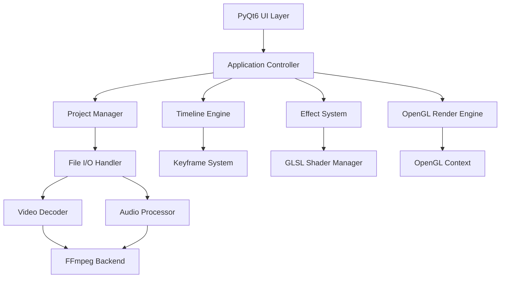

# Design Document

## Overview

The Karaoke Subtitle Creator is a desktop application built on PyQt6 with OpenGL-accelerated rendering. The architecture follows a Model-View-Controller pattern with specialized components for timeline management, effect processing, and real-time rendering. The application leverages hardware acceleration through OpenGL 3.3+ and provides a professional-grade editing environment for karaoke content creation.

## Architecture

### High-Level Architecture



### Core Components

1. **Application Controller**: Central coordinator managing component interactions
2. **Project Manager**: Handles project lifecycle, serialization, and file operations
3. **Timeline Engine**: Manages temporal data, keyframes, and synchronization
4. **Effect System**: Processes text effects, animations, and visual enhancements
5. **Render Engine**: OpenGL-based rendering pipeline for real-time preview and export
6. **UI Layer**: PyQt6 widgets providing user interface and interaction handling

## Components and Interfaces

### Project Manager

**Responsibilities:**

- Project creation, loading, and saving
- Video/audio file import and validation
- Recent projects management
- Project metadata handling

**Key Classes:**

```python
class ProjectManager:
    def create_project(self, video_path: str) -> Project
    def load_project(self, project_path: str) -> Project
    def save_project(self, project: Project, path: str) -> bool
    def import_video(self, path: str) -> VideoAsset
    def get_recent_projects(self) -> List[ProjectInfo]

class Project:
    def __init__(self, video_asset: VideoAsset)
    def add_subtitle_track(self) -> SubtitleTrack
    def get_timeline_duration(self) -> float
    def serialize(self) -> dict
```

### Timeline Engine

**Responsibilities:**

- Timeline state management
- Keyframe interpolation and animation curves
- Audio waveform generation and display
- Temporal synchronization between video and subtitles

**Key Classes:**

```python
class TimelineEngine:
    def add_keyframe(self, track_id: str, time: float, properties: dict)
    def interpolate_properties(self, time: float) -> dict
    def get_waveform_data(self, audio_asset: AudioAsset) -> np.ndarray
    def sync_to_video_frame(self, frame_number: int) -> float

class KeyframeSystem:
    def create_keyframe(self, time: float, properties: dict) -> Keyframe
    def interpolate_between(self, kf1: Keyframe, kf2: Keyframe, t: float) -> dict
    def copy_keyframes(self, selection: List[Keyframe]) -> List[Keyframe]
```

### Effect System

**Responsibilities:**

- Text effect processing and parameter management
- GLSL shader compilation and uniform management
- Particle system simulation
- 3D transformation calculations

**Key Classes:**

```python
class EffectSystem:
    def apply_text_animation(self, text: TextElement, effect: AnimationEffect)
    def render_particle_effect(self, effect: ParticleEffect, time: float)
    def calculate_3d_transform(self, params: Transform3D) -> np.ndarray
    def compile_shader_program(self, vertex_src: str, fragment_src: str) -> int

class ShaderManager:
    def load_shader(self, name: str) -> ShaderProgram
    def set_uniform(self, program: int, name: str, value: Any)
    def bind_texture(self, texture_id: int, unit: int)
```

### Render Engine

**Responsibilities:**

- OpenGL context management and rendering pipeline
- Real-time preview at 60fps with hardware acceleration
- Video frame composition and subtitle overlay
- Export rendering with quality optimization

**Key Classes:**

```python
class RenderEngine:
    def initialize_opengl_context(self) -> bool
    def render_frame(self, time: float, subtitles: List[SubtitleElement])
    def composite_video_frame(self, video_frame: np.ndarray, overlay: np.ndarray)
    def export_frame(self, time: float, resolution: Tuple[int, int]) -> np.ndarray

class OpenGLRenderer(QOpenGLWidget):
    def initializeGL(self)
    def paintGL(self)
    def resizeGL(self, width: int, height: int)
```

## Data Models

### Core Data Structures

```python
@dataclass
class TextElement:
    content: str
    font_family: str
    font_size: float
    color: Tuple[float, float, float, float]
    position: Tuple[float, float]
    rotation: Tuple[float, float, float]
    effects: List[Effect]

@dataclass
class SubtitleTrack:
    id: str
    elements: List[TextElement]
    keyframes: List[Keyframe]
    start_time: float
    end_time: float

@dataclass
class Keyframe:
    time: float
    properties: dict
    interpolation_type: InterpolationType

@dataclass
class VideoAsset:
    path: str
    duration: float
    fps: float
    resolution: Tuple[int, int]
    codec: str

@dataclass
class Project:
    name: str
    video_asset: VideoAsset
    audio_asset: Optional[AudioAsset]
    subtitle_tracks: List[SubtitleTrack]
    export_settings: ExportSettings
    created_at: datetime
    modified_at: datetime
```

### Effect Data Models

```python
@dataclass
class AnimationEffect:
    type: AnimationType  # FADE_IN, SLIDE, TYPEWRITER, BOUNCE
    duration: float
    parameters: dict
    easing_curve: EasingType

@dataclass
class VisualEffect:
    type: VisualEffectType  # GLOW, OUTLINE, SHADOW, GRADIENT
    intensity: float
    color: Tuple[float, float, float, float]
    parameters: dict

@dataclass
class ParticleEffect:
    type: ParticleType  # SPARKLE, FIRE, SMOKE
    emission_rate: float
    lifetime: float
    texture_path: str
    physics_parameters: dict
```

## Error Handling

### Error Categories and Strategies

1. **File I/O Errors**

   - Graceful handling of corrupted or unsupported video files
   - Automatic fallback to software decoding if hardware fails
   - User-friendly error messages with suggested solutions

2. **OpenGL Errors**

   - Context creation failure handling with fallback options
   - Shader compilation error reporting with line numbers
   - GPU memory exhaustion detection and cleanup

3. **Performance Issues**

   - Automatic quality reduction when frame rate drops below 30fps
   - Memory usage monitoring with garbage collection triggers
   - Background processing for non-critical operations

4. **Export Errors**
   - Disk space validation before export initiation
   - Codec availability checking with alternative suggestions
   - Progress recovery for interrupted exports

### Error Handling Implementation

```python
class ErrorHandler:
    def handle_video_import_error(self, error: Exception, file_path: str)
    def handle_opengl_error(self, error_code: int) -> bool
    def handle_export_error(self, error: Exception, context: ExportContext)
    def log_performance_warning(self, metric: str, value: float)

class ValidationSystem:
    def validate_video_file(self, path: str) -> ValidationResult
    def validate_opengl_capabilities(self) -> CapabilityReport
    def validate_export_settings(self, settings: ExportSettings) -> bool
```

## Testing Strategy

### Unit Testing

- **Component Isolation**: Each major component tested independently
- **Mock Dependencies**: Video/audio processing mocked for consistent testing
- **Effect Validation**: Mathematical correctness of transformations and animations
- **Shader Testing**: GLSL shader compilation and uniform handling

### Integration Testing

- **Pipeline Testing**: End-to-end rendering pipeline validation
- **File Format Testing**: Import/export with various video and subtitle formats
- **Performance Testing**: Frame rate consistency under different loads
- **Memory Testing**: Resource cleanup and leak detection

### User Interface Testing

- **Widget Interaction**: Timeline manipulation and parameter adjustment
- **Real-time Updates**: Preview synchronization with user input
- **Error Scenarios**: UI behavior during error conditions
- **Accessibility**: Keyboard navigation and screen reader compatibility

### Performance Testing

```python
class PerformanceTestSuite:
    def test_60fps_preview_1080p(self)
    def test_4k_export_performance(self)
    def test_memory_usage_long_sessions(self)
    def test_gpu_utilization_efficiency(self)
    def benchmark_effect_rendering_times(self)
```

### Test Data Management

- **Sample Assets**: Curated video/audio files for consistent testing
- **Effect Presets**: Standardized effect configurations for regression testing
- **Performance Baselines**: Reference metrics for performance validation
- **Cross-Platform Testing**: Windows, macOS, and Linux compatibility validation
